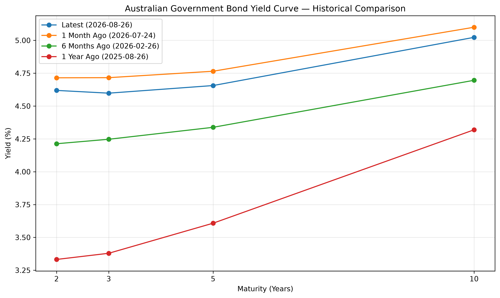
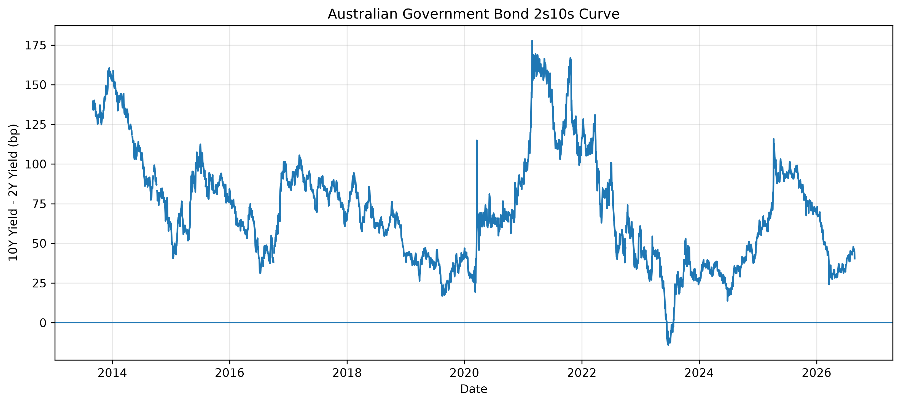
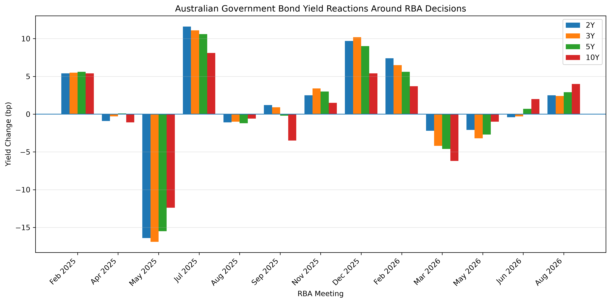
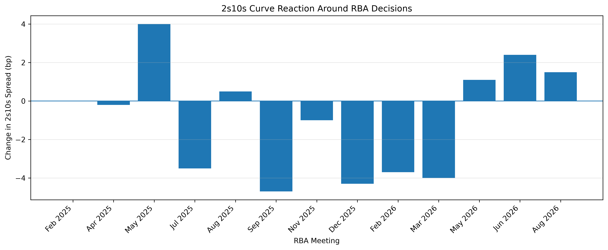

# Australian-rates-trading-lab
Python-based analysis of Australian yield curves, RBA policy events, fixed-income risk and rates trading scenarios.
## Project Overview

This project explores the Australian interest-rate market using Python,
with a focus on yield-curve dynamics, RBA monetary-policy events,
fixed-income risk and rates trading scenarios.

The objective is to understand how macroeconomic information and
monetary-policy expectations translate into market pricing, curve
movements and portfolio risk.

## Components

1. Australian Government Yield Curve Analysis
2. RBA Monetary Policy Event Study
3. Bond Risk & P&L Engine
4. Rates Market View & Scenario Lab

---

## Component 1 : Australian Yield Curve Analysis

The first component examines Australian Government bond yields across
the 2-year, 3-year, 5-year and 10-year maturities using Reserve Bank of
Australia data.

### Key Findings

- As of 26 August 2026, the Australian Government yield curve was
  upward sloping overall, with the 2s10s spread at approximately +40 bp.
- The 2Y–5Y segment was relatively flat, while the curve steepened more
  noticeably toward the 10-year maturity.
- Over the previous month, yields declined across the curve, with the
  front end falling slightly more than the long end, producing a modest
  bull steepening.
- Over the previous year, the 2-year yield increased by approximately
  129 bp compared with around 70 bp for the 10-year yield.
- The 2s10s spread compressed from approximately 99 bp to 40 bp,
  representing a pronounced bear flattening.
- This is consistent with a stronger repricing of near-term monetary
  policy expectations relative to longer-term rates.

### Historical Yield Curve Comparison

### 2s10s Curve

!---

## Component 2 — RBA Monetary Policy Event Study

This component examines how Australian Government bond yields behaved around RBA monetary-policy decisions across the 2-year, 3-year, 5-year and 10-year maturities.

### Key Findings

- Rate cuts generated the largest average absolute market reactions in the sample.
- On average, cuts were associated with larger declines in front-end yields than in the 10-year yield, producing modest 2s10s steepening.
- Hold decisions still generated meaningful repricing, demonstrating that unchanged policy rates do not imply unchanged market expectations.
- Identical headline decisions produced very different yield reactions across meetings.
- The results reinforce that rates markets respond to outcomes relative to expectations rather than mechanically to the direction of a policy decision.

### Yield Reactions Around RBA Decisions

### 2s10s Curve Reactions

