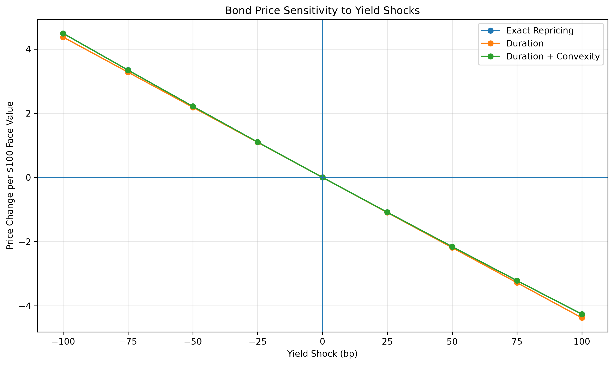
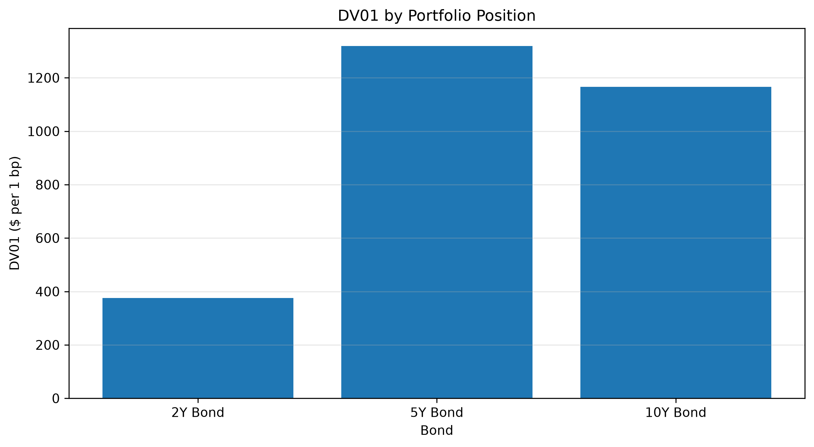
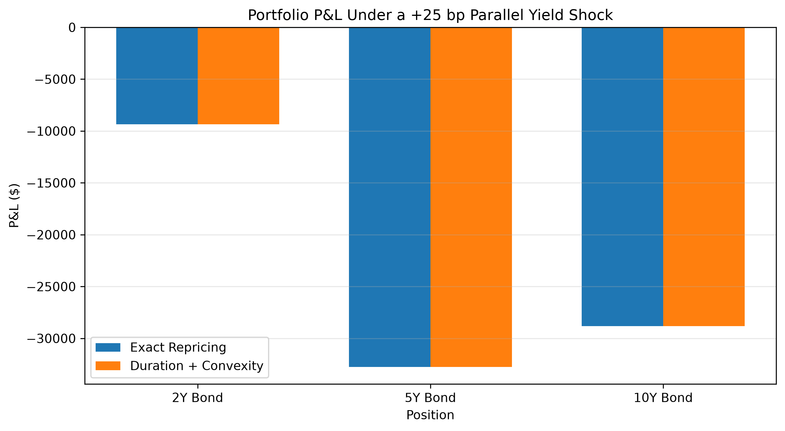
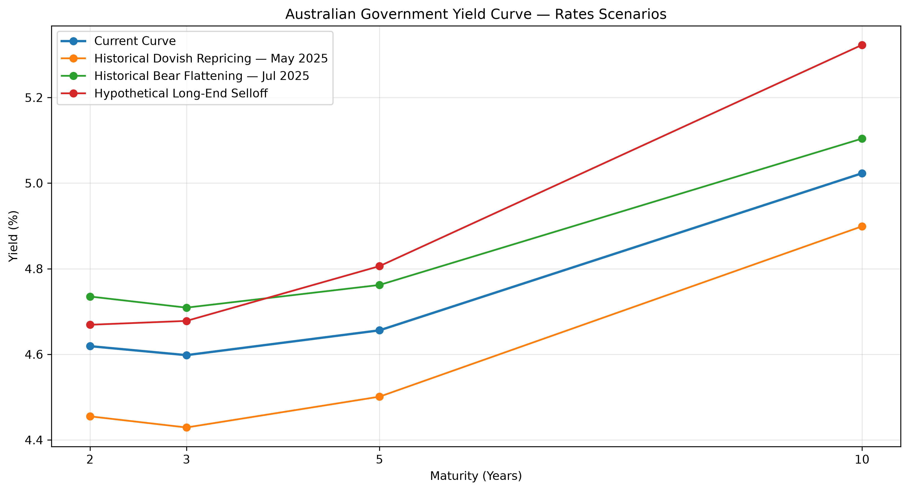
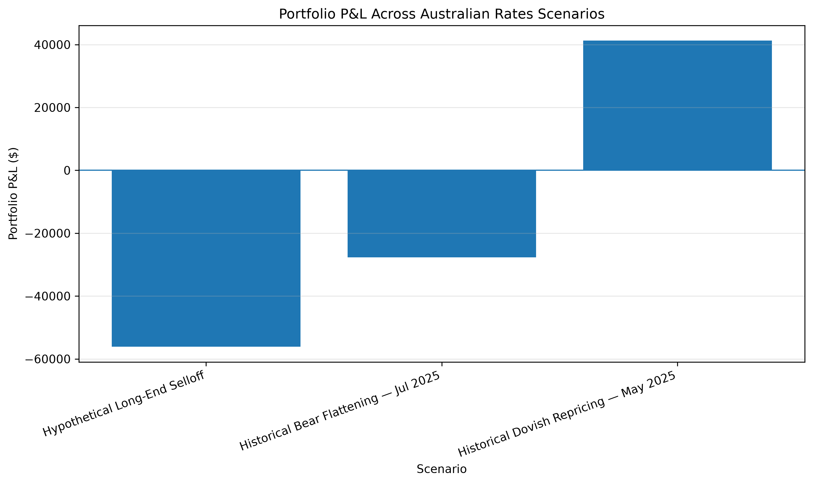

# Australian rates trading lab
Python-based analysis of Australian yield curves, RBA policy events, fixed-income risk and rates trading scenarios.
## Project Overview
This project explores the Australian interest-rate market using Python,
with a focus on yield-curve dynamics, RBA monetary-policy events,
fixed-income risk and rates trading scenarios.

The objective is to understand how macroeconomic information and
monetary-policy expectations translate into market pricing, curve
movements and portfolio risk.
## Interactive Rates Analytics

The Australian Rates Trading Lab also includes an interactive Python-based
risk engine for exploring bond pricing, DV01, convexity, portfolio stress
testing and non-parallel yield-curve scenarios.

### [Launch Interactive Australian Rates Risk Engine →](https://australian-rates-trading-lab-louis.streamlit.app/)
## Components

1. Australian Government Yield Curve Analysis
2. RBA Monetary Policy Event Study
3. Bond Risk & P&L Engine
4. Rates Market View & Scenario Lab

---

## Component 1 : Australian Yield Curve Analysis

The first component examines Australian Government bond yields across
the 2-year, 3-year, 5-year and 10-year maturities using Reserve Bank of
Australia data.

### Key Findings

- As of 26 August 2026, the Australian Government yield curve was
  upward sloping overall, with the 2s10s spread at approximately +40 bp.
- The 2Y–5Y segment was relatively flat, while the curve steepened more
  noticeably toward the 10-year maturity.
- Over the previous month, yields declined across the curve, with the
  front end falling slightly more than the long end, producing a modest
  bull steepening.
- Over the previous year, the 2-year yield increased by approximately
  129 bp compared with around 70 bp for the 10-year yield.
- The 2s10s spread compressed from approximately 99 bp to 40 bp,
  representing a pronounced bear flattening.
- This is consistent with a stronger repricing of near-term monetary
  policy expectations relative to longer-term rates.

### Historical Yield Curve Comparison

### 2s10s Curve

## Component 2 : RBA Monetary Policy Event Study

This component examines how Australian Government bond yields behaved around RBA monetary-policy decisions across the 2-year, 3-year, 5-year and 10-year maturities.

### Key Findings

- Rate cuts generated the largest average absolute market reactions in the sample.
- On average, cuts were associated with larger declines in front-end yields than in the 10-year yield, producing modest 2s10s steepening.
- Hold decisions still generated meaningful repricing, demonstrating that unchanged policy rates do not imply unchanged market expectations.
- Identical headline decisions produced very different yield reactions across meetings.
- The results reinforce that rates markets respond to outcomes relative to expectations rather than mechanically to the direction of a policy decision.

### Yield Reactions Around RBA Decisions

### 2s10s Curve Reactions

## Component 3 : Bond Risk & P&L Engine

This component translates interest-rate movements into bond and portfolio risk using pricing, duration, convexity and DV01.
### Interactive Risk Engine

Explore the calculations dynamically by changing bond characteristics,
portfolio notionals and interest-rate shocks.

[Launch the Interactive Risk Engine →](https://australian-rates-trading-lab-louis.streamlit.app/)
### Key Findings

- The illustrative 5-year bond priced below par because its 4.0% coupon was below its 4.5% yield.
- Modified duration provides a first-order estimate of price sensitivity to yield movements.
- DV01 converts this sensitivity into the approximate dollar P&L impact of a 1 bp yield move.
- Convexity materially improves price-change estimates for larger yield shocks.
- At the portfolio level, DV01 identifies where interest-rate risk is concentrated across maturities.
- Parallel yield shocks can then be translated directly into estimated portfolio P&L.

### Bond Price Sensitivity

### Portfolio DV01

### Portfolio P&L Under +25 bp Shock

## Component 4 : Australian Rates Market View & Scenario Lab

This component combines the Australian yield-curve analysis, RBA event study and fixed-income risk engine to examine portfolio outcomes under historical and hypothetical non-parallel yield-curve scenarios.

### Scenarios

The analysis considers three different Australian rates environments:

- **Historical Dovish Repricing — May 2025:** yields declined across the curve, with the front end falling more than the long end, producing a bull steepening.
- **Historical Bear Flattening — July 2025:** yields increased across the curve, with front-end yields rising more strongly than the long end.
- **Hypothetical Long-End Selloff:** long-term yields rise substantially more than front-end yields, producing a bear steepening.

The first two scenarios reproduce observed one-day Australian Government bond yield movements around RBA meetings. The third is an illustrative stress scenario designed to test long-duration risk.
### Interactive Scenario Lab

Test historical and custom non-parallel Australian yield-curve scenarios
and observe the resulting portfolio P&L.

[Open the Rates Scenario Lab →](https://australian-rates-trading-lab-louis.streamlit.app/)
### Key Findings

- Portfolio outcomes vary materially depending on how different parts of the yield curve move.
- The historical dovish repricing generated positive P&L for the illustrative long-only bond portfolio as yields declined.
- The historical bear flattening generated losses as yields increased across the curve.
- The hypothetical long-end selloff produced the largest portfolio loss, highlighting the sensitivity of long-duration exposure to long-end repricing.
- These results demonstrate why portfolio rates risk cannot be fully understood using only parallel yield shocks.

### Australian Rates Scenarios

### Portfolio P&L Across Scenarios

### Methodology Note

Historical scenarios use observed yield changes from the RBA event study. The portfolio positions and hypothetical long-end selloff are illustrative. The analysis is designed as a risk-management and scenario-testing framework rather than a market forecast.